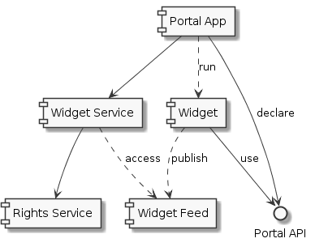

# Sample Portal Application

This React web app is a sample for a portal that hosts other *mini applications* (so called **widgets**). Ideally, these widgets are also build with React, but in practice they could also be build with any technology.

As a proof of concept (POC) the repository contains three widgets:

- One build directly with React
- Another one build in plain JS ("vanilla JS") to demonstrate the generic usage
- Finally, a last one using Angular

Since this is a POC the code is not optimized (e.g., the possibility of extracting Angular and sharing external, lazy loaded packages, is not shown).

## Piral

:rocket: **Update 2019** I've also recreated this sample using [Piral](https://piral.io), which is an awesome framework for building microfrontends. Look for it in the [portal-sample-piral](https://github.com/FlorianRappl/portal-sample-piral) project here on GitHub.

## Architecture

The architecture of the portal application has been derived in such a way to decouple widgets as much as possible from the main application. Ideally, a widget could be a plain component library that additionally exposes one more function. Realistically, it will be a dedicated npm package that either consumes a component library, or was converted from an existing application.

The following diagram explains the sample by introducing the exposed REST services (in our sample its just one service, but in reality it could be two) along with the main application.



While the POC reads the widgets from the file system, a real implementation may get the packages from an internal feed (or some other data source, potentially connected to staging for different environments).

Importantly, external code has always been placed in error boundaries, i.e., external components have to be equipped with `componentDidCatch` and external functions need to be placed in `try`-`catch` blocks. Yes, this is indeed unfortunate, but we should never risk to crash the portal application by one programming mistake in a single widget.

## Building the Code

Before actually building the code we need to resolve all dependencies.

We start by invoking

```bash
npm install
```

in the root directory of the repository. Furthermore, this command needs to be run for all widgets as well. There is also a simpler way to do it - just by running the following command:

```bash
npm run install-all
```

To actually build the portal sample (or *any* widget) we can run:

```bash
npm run build
```

Note that actually having a live demo of the sample should first build *all* widgets (otherwise the widgets, which have not been build, will be missing in the overview) and then start the development server. Like installing all npm packages there is a shortcut command from the root directory to build *all* widgets:

```bash
npm run build-all-widgets
```

Actually starting the development server is as simple as running:

```bash
npm start
```

This command will run two commands concurrently, namely starting the (mock) API server and the webpack dev server. The latter supports hot module reloading, but only for its own contents and not for a widget.

## What's Missing

Obviously, the given repo is just a start focusing on the main challenge. Things that would need to be tackled next (and individually) are

- provide a real widget service, maybe coupled to a (private) npm feed,
- include i18n, especially give widgets the possibilty to use it directly or use a custom solution,
- solve the issue of (shared) external libraries, e.g., that multiple widgets use Angular without bundling it directly to the widget (could greatly help to reduce the size of widgets),
- tooling to debug/run widgets locally,
- increase the portal API surface, and
- provide boilerplates (or even npm packages) for widget projects (at least React, vanilla JS, but potentially also Angular and AngularJS).

## License

The MIT License (MIT)

Copyright (c) 2018 Florian Rappl

Permission is hereby granted, free of charge, to any person obtaining a copy of this software and associated documentation files (the "Software"), to deal in the Software without restriction, including without limitation the rights to use, copy, modify, merge, publish, distribute, sublicense, and/or sell copies of the Software, and to permit persons to whom the Software is furnished to do so, subject to the following conditions:

The above copyright notice and this permission notice shall be included in all copies or substantial portions of the Software.

THE SOFTWARE IS PROVIDED "AS IS", WITHOUT WARRANTY OF ANY KIND, EXPRESS OR IMPLIED, INCLUDING BUT NOT LIMITED TO THE WARRANTIES OF MERCHANTABILITY, FITNESS FOR A PARTICULAR PURPOSE AND NONINFRINGEMENT. IN NO EVENT SHALL THE AUTHORS OR COPYRIGHT HOLDERS BE LIABLE FOR ANY CLAIM, DAMAGES OR OTHER LIABILITY, WHETHER IN AN ACTION OF CONTRACT, TORT OR OTHERWISE, ARISING FROM, OUT OF OR IN CONNECTION WITH THE SOFTWARE OR THE USE OR OTHER DEALINGS IN THE SOFTWARE.
